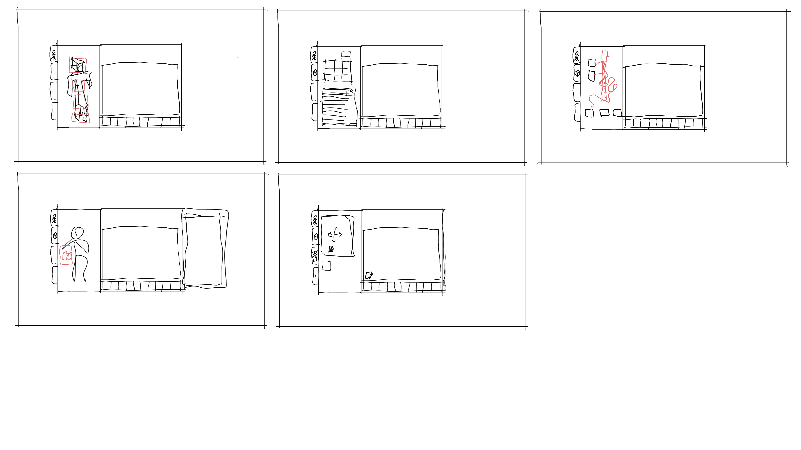

# Player
Player features/actions/designs and workbench ideas/interactions.

## Controls
- `WASD`: Directional movement.
    - Double-tap `W` for sprinting.
    - Double-tap `A/D` for dodge.
    - Press `[Shift]` for sprinting.
- `[Ctrl]` for sneaking, which lowers the player to `1.5` blocks tall.
- Double-tap `[Ctrl]` to go prone; lowers the player to `1` block tall.

- `Left-click` breaks blocks/uses item.
- `Right-clock` places blocks/uses secondary item.
- `Mouse` for camera movement.
- `Scroll-Wheel` to cycle `hotbar`.

- `E` for inventory.

## Inventory
The inventory will be designed to retain the same layout no matter what you have opened.
Some mock-ups:

## Crafting blocks
Interactable block designs.

### Player
Make basic recipes required for survival at the start of the game.

### Workbench
Make basic recipes which don't require any fancy materials/resources. Allows crafting of carpentry-like items.

### Anvil
Make any metal weapons and tools. The quality of tools depends on the anvil used.

### Furnace
Smelts ores into metal plates/ingots.

### Alloy Furnace
Smelts ores/plates into alloy plates.

### Oven
Cooks raw food items into cooked food items.

### Infusion
Infuses rare elements into metals to make alloys. Can be then used to make weapons.

### Alchemy Table
Transmute materials into rare elements.

### Distillery
Brew potions with certain ingredients.

### Masonry Table
Cut stone-like materials into different block types.

## Stats
Multiple stat gui styles for preference.

